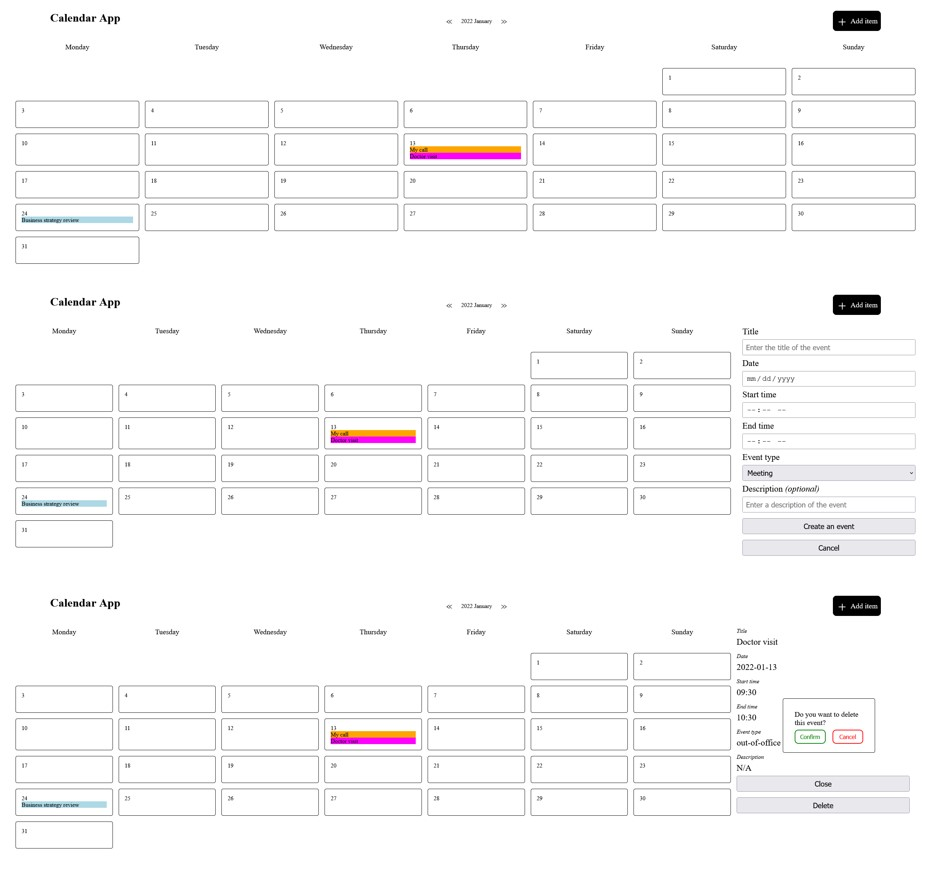

# Simple-calendar-app

This is a simple calendar app to store events. 

## Table of contents

- [Overview](#overview)
  - [The features](#the-features)
  - [Screenshot](#screenshot)
  - [Links](#links)
- [My process](#my-process)
  - [Built with](#built-with)
- [Author](#author)

## Overview

### The features

- Creating events
- Deleting events (with confirmation pop-up)
- Create view appears when "Add event" button is clicked
- Details view appears when event is clicked
- Navigation between months

- Prefill sessionStorage with some test data (only when sessionStorage is empty)

### Screenshot

### Links

- Solution URL: [Simple calendar app](https://vilmis04.github.io/Simple-calendar-app)

## My process

### Built with

- HTML
- CSS
- JavaScript

## Author

- Github - [vilmis04](https://github.com/vilmis04)
- LinkedIn - [Vilmantas Sudaris](https://www.linkedin.com/in/vilmantas-sudaris-63567586)
